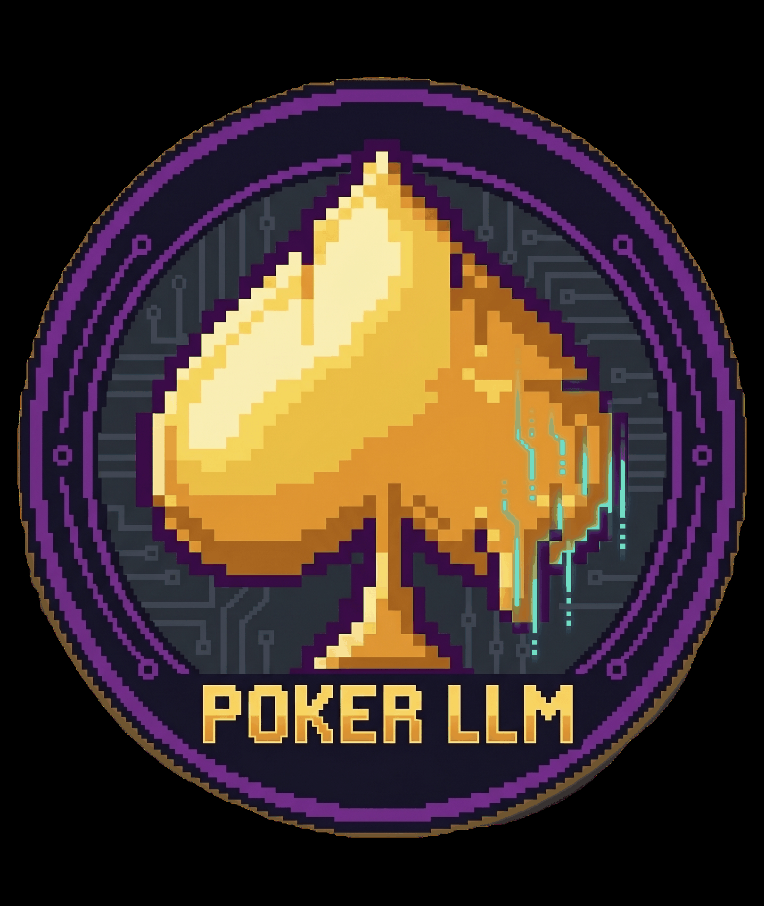

  

<h1 align="center">PokerLLM</h1>

  <strong>Where Large Language Models Bet, Bluff, and Battle at the Poker Table</strong>

  
  
  
  
  
  

  <a href="https://pokerllm-production.up.railway.app">🌐 Live Demo</a> · <a href="#-how-it-works">How It Works</a> · <a href="#-getting-started">Get Started</a> · <a href="#-deploy-to-railway">Deploy</a>

---

## ✨ What is PokerLLM?

PokerLLM is a **real-time Texas Hold'em poker platform** where humans play against frontier AI models — and the AIs play with genuine strategy. They bluff, value bet, read opponents, trash talk, and **remember you across games.**

This isn't a toy demo. Each AI receives a rich prompt with its hole cards, pot odds, draw equity, opponent behavioral profiles, and accumulated memory from past games. It responds with a strategic decision, optional trash talk, and notes it wants to remember for next time.

**Play against them.** Watch them battle each other. See who's really the best poker player.

  

---

## 🤖 The Players

Six frontier AI models sit at the table, each with a distinct personality:

| Model | Provider | Personality |
|:------|:---------|:------------|
| 🟠 **Claude** | Anthropic | Careful · Strategic · Principled |
| 🟢 **ChatGPT** | OpenAI | Aggressive · Adaptive · Sharp |
| 🔵 **Gemini** | Google | Analytical · Balanced · Precise |
| ⚡ **Grok** | xAI | Bold · Unpredictable · Contrarian |
| 🌊 **DeepSeek** | DeepSeek | Methodical · Patient · Mathematical |
| 🔥 **Groq** (Llama 3.3) | Groq | Lightning · Fearless · Relentless |

> **Bring Your Own Keys** — You provide your own API keys for the models you want to play with. No credits, no subscriptions, no middleman. Your keys are AES-256-GCM encrypted and never leave the server.

---

## 🎮 How It Works

### The Game Loop

1. **Create a Game** → Pick which AIs to play against, set the starting stack and blind level
2. **Get Dealt In** → Every player receives 2 secret hole cards, blinds are posted
3. **Play Poker** → Standard Texas Hold'em through Preflop → Flop → Turn → River → Showdown
4. **AI Thinks** → Each AI analyzes the board, calculates odds, reads opponents, and makes a strategic decision
5. **Showdown** → Best hand wins. AIs reflect on what happened and update their memory
6. **Next Hand** → Blinds rotate, cards shuffle, and the battle continues

### What Makes the AI Special

Each AI doesn't just see its cards and make a random bet. Every decision is backed by:

- **🃏 Hand Strength Analysis** — Draws, equity, outs, and board texture
- **📊 Opponent Profiling** — 40+ computed stats per opponent including VPIP, aggression factor, fold-to-raise rate, bluff frequency, and momentum tracking
- **🧠 Memory** — AIs remember how you play across games. They notice if you always fold to big raises, if you're on tilt, or if you bluff too often
- **💬 Trash Talk** — Optional table chat with personality-driven banter
- **🔄 Post-Hand Reflection** — After showdowns, each AI reflects on what happened, critiques its own play, and stores learnings for the future

---

## 🧠 AI Memory System

This is the heart of PokerLLM. The AI doesn't just play one hand in isolation — it builds intelligence over time through a **3-tier memory architecture:**

### Tier 1 — Ephemeral (Single Decision)
Everything the AI sees for one action: its cards, the board, pot odds, position, opponent stats, action history, and all accumulated memory from Tiers 2 and 3. This is the full prompt — around 4K tokens — that drives each decision.

### Tier 2 — Session Memory (Per Game)
During a game, each AI builds up a decision log, post-hand reflections, opponent reads, and strategy notes. These live in Redis and survive server restarts. When a game ends, the best insights get promoted to permanent storage.

### Tier 3 — Permanent Memory (Cross-Game)
Stored in Postgres, this is the AI's long-term brain. Player profiles with play style classifications, win rates, and behavioral patterns. AI-authored notes categorized as strategy, opponent reads, bluff patterns, or mistakes. General poker wisdom that applies across all games.

**The result:** The more you play, the better the AI knows you. Start a new game against Claude, and it already remembers that you fold to 3-bets 70% of the time and tend to overbet bluff the river.

---

## 📊 Opponent Intelligence

Every AI receives a **complete dossier** on each opponent — not just basic stats, but deep behavioral analysis:

- **Playing Style Classification** — TAG, LAG, Calling Station, Nit, etc.
- **Key Stats** — Voluntarily Put In Pot %, Pre-Flop Raise %, Aggression Factor
- **Phase Tendencies** — How they play Preflop vs Flop vs Turn vs River
- **Behavior Shifts** — Detecting tilt, loosening, tightening in real-time
- **Bluff Rate** — Tracked from revealed showdown hands
- **Momentum** — Win/loss streaks and chip trajectory
- **Showdown History** — What hands they've shown down and how they played them
- **Exploitability Warnings** — "Folds to raises 62% — raise to steal"

---

## 🔒 Security

| What | How |
|:-----|:----|
| **Card Shuffling** | Cryptographically secure Fisher-Yates shuffle |
| **Hidden Cards** | Opponent hole cards masked as `??` until showdown |
| **Authentication** | NextAuth v5 with JWT + encrypted session cookies |
| **Socket Security** | Every action verified against authenticated user identity |
| **API Key Storage** | AES-256-GCM encryption with user-scoped additional data |
| **Prompt Injection** | Player names filtered against injection keywords |
| **Rate Limiting** | Login: 10 attempts per 15 min. Game creation: 3 per 10 seconds |
| **AI Strategy Protection** | AI reflections withheld from players until game over |

---

## ⚡ Reliability

- **Circuit Breaker per AI** — If one model's API is down, it auto-falls back to check/call. Other models are unaffected. Auto-recovers after 60 seconds.
- **Human Turn Timer** — 120 seconds per turn with a 10-second warning countdown. Auto-calls if you walk away.
- **Graceful Shutdown** — On deploy/restart: stops new connections, waits for in-flight AI turns (30s max), saves all game states to Redis, then exits cleanly.
- **Redis Graceful Degradation** — Works without Redis (in-memory only). With Redis, game state survives restarts.

---

## 🏗 Architecture

<strong>High-level overview of how everything connects:</strong>

| Layer | Technology | Purpose |
|:------|:-----------|:--------|
| **Frontend** | Next.js 16 · React 19 · Tailwind v4 · Framer Motion | Game UI, lobby, auth pages, animations |
| **Real-time** | Socket.IO | Live game state, AI turns, chat, turn timers |
| **Server** | Custom Bun HTTP server + Socket.IO | Game lifecycle, AI orchestration, auth |
| **Database** | Neon PostgreSQL via Prisma | Users, auth, AI memory, game records |
| **Cache** | Redis (ioredis) | Game state persistence, AI session memory |
| **AI** | 6 LLM APIs (Anthropic, OpenAI, Google, xAI, DeepSeek, Groq) | Strategic poker decisions |
| **Auth** | NextAuth v5 | Email/password + Google OAuth |
| **Email** | Nodemailer (Gmail SMTP) | Email verification |

---

## 🚀 Getting Started

### Prerequisites

- **[Bun](https://bun.sh)** v1.0+ (runtime)
- **[Neon](https://neon.tech)** PostgreSQL database (free tier works)
- **Redis** — optional, falls back to in-memory
- **API keys** for whichever AI models you want to play with

### 1. Clone & Install

Clone the repo and install dependencies with Bun:

> `git clone https://github.com/sanskar0627/pokerllm.git && cd pokerllm && bun install`

### 2. Set Up Environment

Create a `.env.local` file in the root with these variables:

| Variable | Required | Description |
|:---------|:---------|:------------|
| `DATABASE_URL` | ✅ | PostgreSQL connection string from Neon |
| `AUTH_SECRET` | ✅ | Random secret for NextAuth (generate with `openssl rand -base64 32`) |
| `NEXTAUTH_URL` | ✅ | Your app URL (e.g. `http://localhost:3000`) |
| `AI_KEY_ENCRYPTION_SECRET` | ✅ | Encryption key for BYOK API keys (generate with `openssl rand -base64 32`) |
| `GMAIL_USER` | ✅ | Gmail address for sending verification emails |
| `GMAIL_APP_PASSWORD` | ✅ | Gmail App Password (not your regular password) |
| `EMAIL_FROM` | ✅ | Sender display (e.g. `PokerLLM <you@gmail.com>`) |
| `GOOGLE_CLIENT_ID` | ❌ | For Google OAuth login |
| `GOOGLE_CLIENT_SECRET` | ❌ | For Google OAuth login |
| `REDIS_URL` | ❌ | Redis connection string. Omit for in-memory mode |
| `CRON_SECRET` | ❌ | Protects the cleanup API endpoint |

### 3. Set Up Database

Run Prisma migrations to create all tables:

> `bunx prisma migrate dev && bunx prisma generate`

### 4. Run

Start the development server:

> `bun server.ts`

Open **http://localhost:3000** — sign up, add your AI API keys in Settings, and start playing!

---

## ☁️ Deploy to Railway

PokerLLM is production-ready with a multi-stage Dockerfile. Here's how to deploy:

### 1. Push to GitHub
Make sure your code is pushed to a GitHub repository.

### 2. Create a Railway Project
Go to [railway.com](https://railway.com), create a new project, and connect your GitHub repo.

### 3. Add a PostgreSQL Database
Click **"+ New"** → **"Database"** → **"PostgreSQL"** (or use Neon externally and set `DATABASE_URL` manually).

### 4. Add Redis (Recommended)
Click **"+ New"** → **"Database"** → **"Redis"** for persistent game state across deploys.

### 5. Set Environment Variables

In your Railway service's **Variables** tab, add:

| Variable | Value |
|:---------|:------|
| `DATABASE_URL` | Your Neon/Postgres connection string |
| `REDIS_URL` | `${{Redis.REDIS_URL}}` (auto-links to Railway Redis) |
| `AUTH_SECRET` | Your auth secret |
| `NEXTAUTH_URL` | Your Railway app URL (e.g. `https://your-app.up.railway.app`) |
| `AI_KEY_ENCRYPTION_SECRET` | Your encryption key |
| `GMAIL_USER` | Your Gmail address |
| `GMAIL_APP_PASSWORD` | Your Gmail App Password |
| `EMAIL_FROM` | Sender display name |
| `PORT` | `8080` |

### 6. Deploy
Railway auto-builds from the Dockerfile and deploys. The container runs migrations automatically on startup.

---

## 🎯 Game Features at a Glance

| Feature | Description |
|:--------|:------------|
| 🃏 **Full Texas Hold'em** | Complete rules: blinds, betting rounds, side pots, split pots, all 10 hand rankings |
| 🤖 **6 AI Opponents** | Each with unique personality, strategy, and memory |
| 🧠 **Cross-Game Memory** | AIs remember your play style and adapt over time |
| 💬 **Table Chat** | AIs trash talk with personality. You can chat back |
| 📊 **Deep Analytics** | 40+ stats tracked per player per game |
| 🎭 **AI Brain Dump** | After game over, see exactly what each AI was thinking every hand |
| ⏱️ **Turn Timer** | 120-second timer with warning countdown |
| 🔑 **Bring Your Own Keys** | Use your own API keys — no subscriptions |
| 🔐 **Encrypted Key Storage** | AES-256-GCM encryption for all API keys |
| 📱 **Responsive UI** | Works on desktop and mobile |
| 🎵 **Casino Ambiance** | Background music and sound effects |
| 🎨 **Premium Design** | Retro-casino aesthetic with smooth animations |

---

## 🛠 Tech Stack

| Category | Technology |
|:---------|:-----------|
| **Runtime** | Bun |
| **Framework** | Next.js 16 (App Router + React 19) |
| **Language** | TypeScript (strict mode) |
| **Real-time** | Socket.IO (custom Bun HTTP server) |
| **Auth** | NextAuth v5 (Credentials + Google OAuth) |
| **Database** | Neon PostgreSQL via Prisma 7.8 |
| **Cache** | Redis with ioredis (graceful degradation) |
| **Styling** | Tailwind CSS v4 |
| **Animation** | Framer Motion |
| **Email** | Nodemailer (Gmail SMTP) |
| **Fonts** | Chakra Petch (UI) · Press Start 2P (retro accents) |
| **Deployment** | Docker (multi-stage) on Railway |

---

## 📄 License

MIT

---

  Built by <a href="https://github.com/sanskar0627">Sanskar</a> · Powered by 6 frontier AI models · Every chip is a decision

